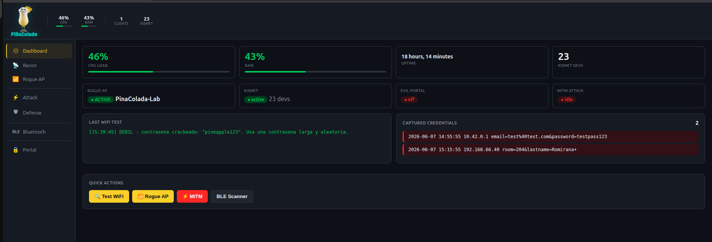

# 🍍 Piña Colada

A portable WiFi security lab that runs on a Raspberry Pi **or any Linux laptop**. Open-source alternative to the WiFi Pineapple — web UI included, zero proprietary hardware required.



---

## What it does

Piña Colada turns a Raspberry Pi 4 — or any Linux laptop — plus a cheap USB WiFi adapter into a full wireless auditing platform, accessible from any browser on the network.

| Feature | Description |
|---|---|
| **Recon** | Passive airodump-ng scan with live AP table and 2.4 GHz channel analyzer |
| **WiFi Audit** | Handshake capture + targeted deauth + dictionary crack. Falls back to PMKID (no clients needed) |
| **Rogue AP** | Hostapd-backed soft AP with Evil Twin cloning |
| **Captive Portal** | Custom HTML templates, live credential capture log, one-click DNS redirect |
| **MITM** | ARP spoof + DNS/SNI traffic monitor chain |
| **BLE Scanner** | Detects AirTags, skimmers (HC-0x, BlueSweep), and Apple devices via Bluetooth 5.0 |
| **Beacon Spam** | Flood the airspace with fake SSIDs via mdk4 |
| **IDS** | Kismet passive monitor with alert feed |

> **For authorized use only.** Only test networks you own or have explicit written permission to test. See [Legal](#legal).

---

## Hardware

| Component | Tested model | Approx. cost |
|---|---|---|
| Raspberry Pi 4 (2GB+ RAM) | Pi 4B 4GB | €55 |
| Monitor-mode USB WiFi adapter | Mercusys MU6H (RTL8811CU) | €15 |
| MicroSD card (16GB+) | Any class 10 | €8 |

**The RTL8811CU chipset is required** — it supports monitor mode and packet injection out of the box on Kali Linux via the mainline `rtw88` driver. Other chipsets are untested.

The built-in Pi WiFi (`wlan0`) is used as the rogue AP. The USB adapter (`wlan1`) handles monitor/injection.

### Running on a laptop instead of a Pi

There is no Pi-specific code — it's plain Linux, so it also runs on any Kali/Debian laptop. The installer auto-detects whether the host uses `dhcpcd` (Pi) or NetworkManager (laptop) and configures the AP interface accordingly.

**The host was never the bottleneck — the WiFi adapter is.** A laptop's built-in card usually can't be the rogue AP *and* do monitor/injection at the same time, so you still need a compatible USB adapter (RTL8811CU), ideally two interfaces: one for the AP, one for monitor. Swapping a Pi for a laptop saves you the €55 board, not the adapter.

---

## Requirements

- **OS**: Kali Linux 2024+ (Raspberry Pi image or a laptop install; any Debian-based distro should work)
- **Python**: 3.9+ (stdlib only — no pip dependencies for the dashboard)
- **Root**: required (raw sockets, monitor mode, port 80)

---

## Quick install

```bash
git clone https://github.com/romirana1407/pinacolada.git
cd pinacolada
sudo bash install.sh
```

To install somewhere other than `/opt/pinacola` (e.g. on a laptop), set `PINACOLA_HOME`:

```bash
sudo PINACOLA_HOME="$HOME/pinacola" bash install.sh
```

Then open `http://<host-ip>:8080` in any browser on the same network.

The installer sets up a systemd service (`pinacola`) that starts automatically on boot.

---

## Manual install

### 1. Install system dependencies

```bash
sudo apt update
sudo apt install -y \
  aircrack-ng hcxdumptool hcxtools hashcat mdk4 \
  kismet hostapd dnsmasq python3 \
  iw iptables tcpdump tshark dsniff
pip install bleak  # optional — richer BLE data (RSSI, manufacturer)
```

### 2. Copy files

```bash
sudo cp -r . /opt/pinacola
sudo chmod +x /opt/pinacola/*.sh /opt/pinacola/*.py
```

### 3. Install the service

```bash
sudo cp systemd/pinacola.service /etc/systemd/system/
sudo systemctl daemon-reload
sudo systemctl enable --now pinacola
```

### 4. Configure your AP (optional)

Edit `/opt/pinacola/conf/hostapd.conf` to change the SSID, channel, or WPA2 passphrase before first boot.

---

## Usage

Open `http://<pi-ip>:8080` from any device on the same network.

```
Dashboard   → live system stats, quick status overview
Recon       → passive WiFi scan, channel analyzer, WiFi audit (PMKID + handshake)
Rogue AP    → start/stop AP, evil twin cloning, captive portal control
Attack      → MITM chain, deauth, beacon spam
Defense     → Kismet IDS feed and alerts
Bluetooth   → BLE scanner with AirTag / skimmer detection
Portal      → captive portal template editor, credential log
```

### WiFi Audit flow

1. Run a Recon scan to discover nearby APs
2. Click **Target** on the AP you want to audit (must be yours or authorized)
3. Hit **Launch audit** — Piña Colada captures a handshake via airodump-ng + targeted deauth
4. If the AP uses 802.11w MFP and ignores deauth, it automatically falls back to **PMKID capture** (hcxdumptool v7 + hashcat mode 22000)
5. Result appears in the Recon tab and on the Dashboard

### Captive Portal flow

1. Go to **Portal** tab → pick a built-in template or write your own HTML
2. Click **Save & Activate**
3. Click **Activate portal** — DNS on the rogue AP is redirected to the Pi, portal-server serves your page on port 80
4. Any client that opens a browser sees your portal; form submissions are logged in real time

### Push alerts (defensive watchdog)

`alert-notify.py` polls Kismet and pushes a phone notification (via [ntfy.sh](https://ntfy.sh))
when it sees a deauth flood, rogue/spoofed AP, or suspicious probe — so the rig watches
your own network even when no browser is open.

```bash
cp .env.example .env          # then set NTFY_TOPIC to a private, unguessable value
sudo cp .env /opt/pinacola/.env
sudo cp systemd/pinacola-alert.service /etc/systemd/system/
sudo systemctl daemon-reload && sudo systemctl enable --now pinacola-alert
```

Subscribe to the same topic in the ntfy mobile app to receive the alerts.

---

## Built-in portal templates

| Template | Style |
|---|---|
| `wifi-generico` | Generic WiFi login (email + password) |
| `hotel` | Hotel check-in (room number + surname) |
| `empresa` | Corporate login (email + password, blue theme) |

Write your own in the in-browser HTML editor. Any `<form method=POST action=/login>` field is captured automatically.

---

## Project structure

```
pinacola/
├── pinacola.py          # Main dashboard server (port 8080)
├── engine.py            # Backend logic — scans, attacks, state machine
├── ui.py                # HTML/JS dashboard rendering
├── config.py            # Paths + settings (auto-locates the install dir)
├── portal-server.py     # Captive portal HTTP server (port 80)
├── wifitest.sh          # WiFi audit: capture → deauth → crack → PMKID
├── mitm-attack.sh       # Rogue-AP gateway MITM (DNS/SNI monitor)
├── mitm-router.sh       # ARP-spoof MITM against an external router
├── beacon-spam.sh       # mdk4 beacon flood
├── ble-scan.py          # BLE scanner (bleak / hcitool fallback)
├── alert-notify.py      # Defensive watchdog → ntfy push alerts
├── portals/             # Captive portal HTML templates
├── conf/                # hostapd + dnsmasq configs
├── systemd/             # systemd units (pinacola, pinacola-alert)
├── .env.example         # NTFY_TOPIC and other private values
└── install.sh           # One-command installer
```

---

## Legal

Piña Colada is a **security research and education tool**.

- Only use it on networks you own or have **explicit written authorization** to test
- Captive portals that capture credentials must only be deployed in authorized penetration testing engagements
- Deauth, beacon spam, and MITM features are illegal if used against third-party networks without permission in most jurisdictions
- The authors take no responsibility for misuse

This project uses standard open-source security tools (aircrack-ng, hcxdumptool, hashcat, mdk4, kismet) that are widely distributed and legal to use in authorized contexts.

---

## License

MIT License — see [LICENSE](LICENSE)

---

## Contributing

Issues and PRs welcome. If you add a new portal template, BLE detection pattern, or support for a different WiFi chipset, open a PR.
